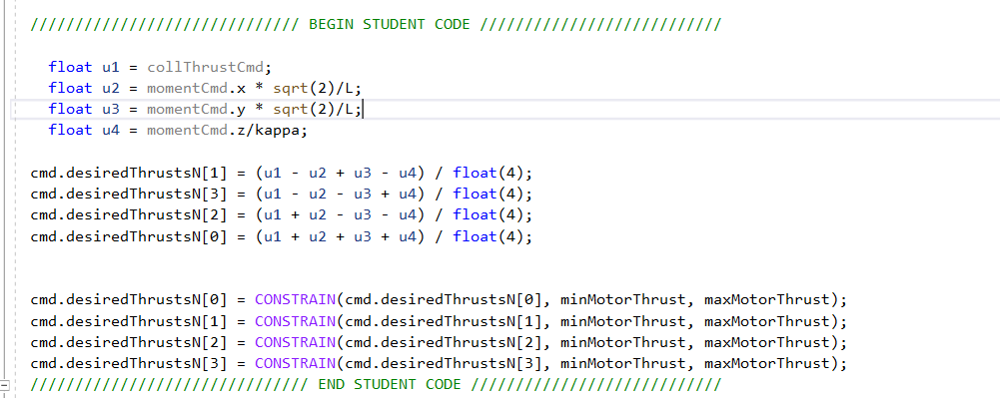

## Scenario 2
For the second scenario we need to implement the body rate and roll/pitch controller.
First we need to implement the GenerateMotorCommands() function. below is the snippet of the code:

Where we can see the equations for the moments with respect to each axis and the total thrust.
Solving for each individual thrust we get the linear combinations. We additionally constrain the thrust for each motor
according to the capabilities. 

We then fix the BodyRate controller. This is a simple proportional controller.
We compute the error of the rate and the commanded moments are simply proportional to the rate.

As a last step for this scenario is the RollPitchControl().

This provides the following movement:

## Scenario 3
In this scenario we need to implement the lateral position, altitude control and yaw control.
For the lateral position we basically implement a PD controller, see below:

Note the minus that was needed in the x and y components. It has to do with the convention we used for the motors.

For the altitude control, we implemented a PID controller. Note that the integral part of the controller is required in 
scenario 4.

For the yaw controller we simply implement a Proportional control since it is a first order system.

This provides the following movement:

## Scenario 4

For this scenario the Integral part of the PID for the altitude control has been added, so that it can address the accumulated errors.
Also the yaw gains have been substantially relaxed (see parameters).

This provides the following movement:

## Scenario 5

For this scenario, the goal is to follow the trajectories as close as possible (with minimum error).
The quad with the yellow trajecory eventually does a good job and passes the criteria, however the quad with the
red trajectory which suffers from erroneous mass entering the calculations starts off with a large error and unstable trajectory.
With further fine tuning of the gains, we would be able to achieve a more stable trajectory for both quads.

